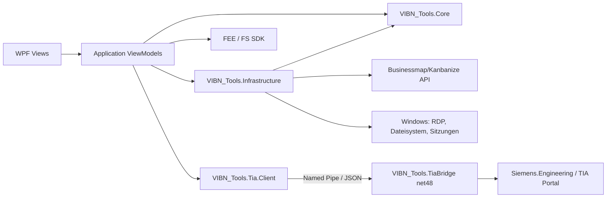
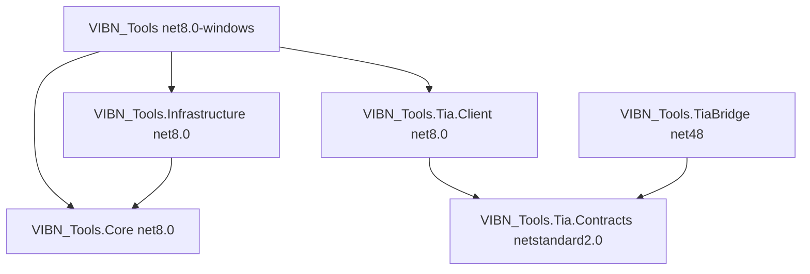
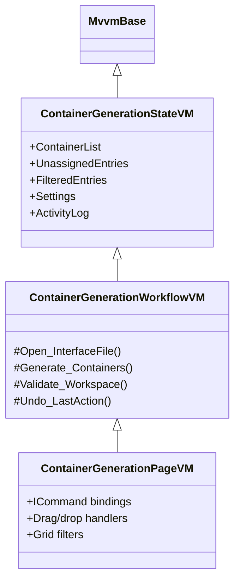
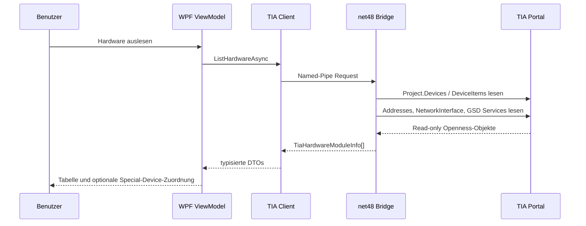
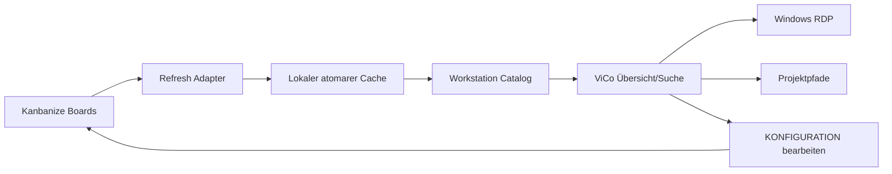

# Architektur- und Datenflussdiagramme

## Komponenten

```mermaid
flowchart LR
    UI[WPF Views] --> VM[Application ViewModels]
    VM --> CORE[VIBN_Tools.Core]
    VM --> INFRA[VIBN_Tools.Infrastructure]
    VM --> FEE[FEE / FS SDK]
    VM --> TC[VIBN_Tools.Tia.Client]
    INFRA --> CORE
    INFRA --> KB[Businessmap/Kanbanize API]
    INFRA --> WIN[Windows: RDP, Dateisystem, Sitzungen]
    TC -->|Named Pipe / JSON| TB[VIBN_Tools.TiaBridge net48]
    TB --> TIA[Siemens.Engineering / TIA Portal]
```

## Projektabhängigkeiten

```mermaid
flowchart TD
    APP[VIBN_Tools net8.0-windows] --> CORE[VIBN_Tools.Core net8.0]
    APP --> INFRA[VIBN_Tools.Infrastructure net8.0]
    APP --> CLIENT[VIBN_Tools.Tia.Client net8.0]
    INFRA --> CORE
    CLIENT --> CONTRACTS[VIBN_Tools.Tia.Contracts netstandard2.0]
    BRIDGE[VIBN_Tools.TiaBridge net48] --> CONTRACTS
```

## Container-Generator-Klassen

```mermaid
classDiagram
    MvvmBase <|-- ContainerGenerationStateVM
    ContainerGenerationStateVM <|-- ContainerGenerationWorkflowVM
    ContainerGenerationWorkflowVM <|-- ContainerGenerationPageVM
    class ContainerGenerationStateVM {
      +ContainerList
      +UnassignedEntries
      +FilteredEntries
      +Settings
      +ActivityLog
    }
    class ContainerGenerationWorkflowVM {
      #Open_InterfaceFile()
      #Generate_Containers()
      #Validate_Workspace()
      #Undo_LastAction()
    }
    class ContainerGenerationPageVM {
      +ICommand bindings
      +Drag/drop handlers
      +Grid filters
    }
```

## TIA-Hardwaredatenfluss

```mermaid
sequenceDiagram
    participant U as Benutzer
    participant W as WPF ViewModel
    participant C as TIA Client
    participant B as net48 Bridge
    participant T as TIA Portal
    U->>W: Hardware auslesen
    W->>C: ListHardwareAsync
    C->>B: Named-Pipe Request
    B->>T: Project.Devices / DeviceItems lesen
    B->>T: Addresses, NetworkInterface, GSD Services lesen
    T-->>B: Read-only Openness-Objekte
    B-->>C: TiaHardwareModuleInfo[]
    C-->>W: typisierte DTOs
    W-->>U: Tabelle und optionale Special-Device-Zuordnung
```

## ViCo/Kanbanize-Datenfluss

```mermaid
flowchart LR
    KB[Kanbanize Boards] --> REF[Refresh Adapter]
    REF --> CACHE[Lokaler atomarer Cache]
    CACHE --> CAT[Workstation Catalog]
    CAT --> SEARCH[ViCo Übersicht/Suche]
    SEARCH --> RDP[Windows RDP]
    SEARCH --> PATH[Projektpfade]
    SEARCH --> CFG[KONFIGURATION bearbeiten]
    CFG --> KB
```

