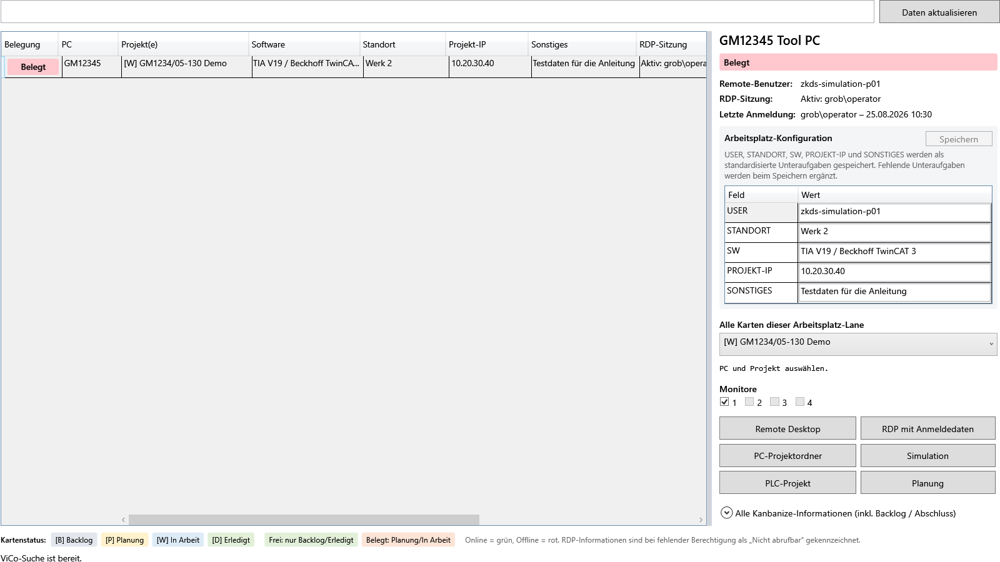
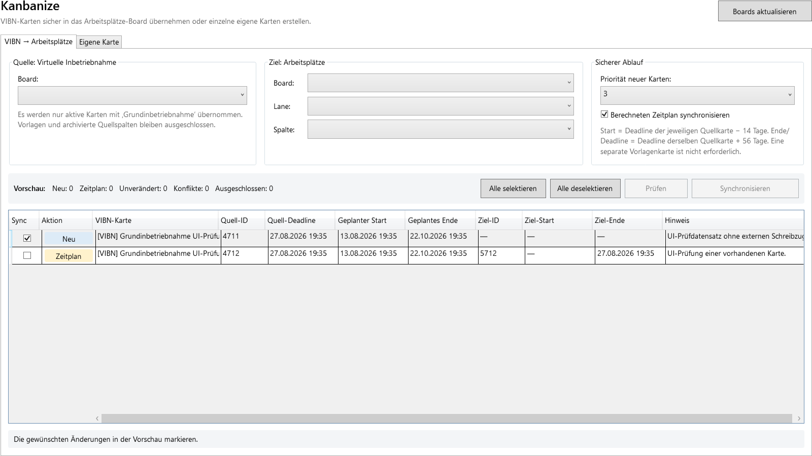
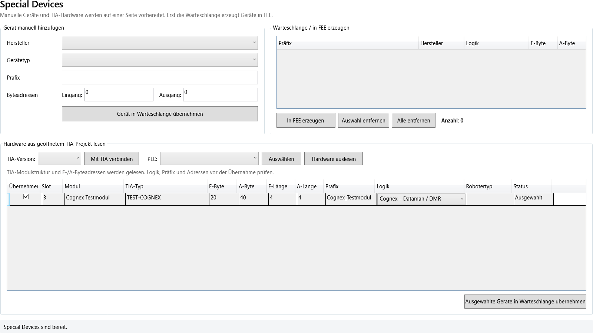

# Benutzerhandbuch

## Zweck und Grundprinzip

VIBN Tools bündelt vorhandene Werkzeuge für Modellierung, FEE und virtuelle Inbetriebnahme mit ViCo, Kanbanize und TIA Portal. Die bisherigen VIBN-Reiter bleiben eigenständige Funktionsbereiche. ViCo ergänzt sie um einen zentralen Blick auf Arbeitsplätze, Projekte, Remote-Zugriff und Arbeitsvorbereitung.

Die Anwendung arbeitet defensiv: externe Aktionen werden erst nach einer bewussten Schaltfläche ausgeführt, Offline-PCs erhalten keine Remote-/Pfadaktionen und Fehler erscheinen in der Statuszeile sowie im Diagnoseprotokoll.

## Reiterübersicht

| Reiter | Zweck | Mindestrolle |
| --- | --- | --- |
| Project Settings | Online-FEE-PC wählen, Verbindung prüfen, Projektbasis anlegen | alle |
| Kanbanize Karten | VIBN-Karten ins Arbeitsplätze-Board synchronisieren; eigene Karten erstellen | Level8 |
| ViCo | PC-/Projektsuche sowie Projekte und Favoriten | alle |
| Transfer | Dateien und Ordner zwischen Projektpfaden übertragen | alle |
| TIA Portal | PLC-, Bibliotheks- und Achsenfunktionen über die isolierte TIA-Bridge | alle |
| Administration | Rollen, Termine und verfügbare Versionen verwalten | Level9 |
| CAD Wizard | Joints, Sensoren, Templates und CAD-Hilfen | Level7 |
| Zuli Converter | Zuli-Datei einlesen und Interface-Datei erzeugen | alle |
| Container Generation | Container aus Interface- und Requirements-Dateien prüfen und generieren | Level7 |
| Container2Fee | Container XML mit FEE-Simulationsobjekten verbinden | Level7 |
| Container2FEE Visual | zusätzliche Planansicht mit Drag-and-drop; nutzt denselben Generator | Level7 |
| FEE2Container | exportiert ContainerFiles aus künftig durch Container2FEE erzeugten Roots | Level7 + FEE-Verbindung |
| SpecialDevices2FEE | Geräte manuell oder aus TIA-Hardware vorbereiten und in FEE erzeugen | alle |
| Model Validation | Modell-/FEE-Daten prüfen | alle |
| Model Control | Roboter, Achsen, Objekte und Simulation steuern | alle |
| Interface Operation | Schnittstellen und Signale laden, verbinden und bearbeiten | alle |
| AI-Test | Trainings-/Testbereich | Level8 |

Die Berechtigungen sind im Detail in der [Rollenverwaltung](ROLLENVERWALTUNG.md) beschrieben.

Mit **Navigation einklappen** im Kopfbereich werden die Texte der linken Navigation ausgeblendet; Symbole und ausgewählter Arbeitsbereich bleiben erhalten. **Alt+N** schaltet denselben Zustand um. Die Auswahl wird im lokalen Benutzerprofil gespeichert und beim nächsten Start wiederhergestellt.

## Empfohlener Arbeitsablauf

1. In **Project Settings** den gewünschten Online-PC filtern, auswählen und die FEE-Verbindung aufbauen.
2. In **ViCo → PC-/Projektsuche** den Arbeitsplatz oder das Projekt suchen und Kanbanize-Daten aktualisieren, falls notwendig.
3. Falls eine Karte benötigt wird, im Hauptreiter **Kanbanize Karten** zuerst die Vorschau ausführen und erst danach bewusst synchronisieren.
4. Für TIA-nahe Schritte den Hauptreiter **TIA Portal** oder den TIA-Hardwarebereich auf der gemeinsamen Seite **SpecialDevices2FEE** verwenden.
5. Änderungen, Fehler und externe Zugriffe am unteren Rand im Diagnoseprotokoll nachvollziehen.

## Project Settings

Das editierbare Dropdown **Online-PC eingeben oder auswählen** ist Auswahl und Filter in einem Feld. Es filtert sofort nach Namen und enthält ausschließlich erreichbare PCs aus dem gemeinsamen ViCo-Arbeitsplatzverzeichnis. Offline-PCs werden absichtlich nicht angeboten.

1. Bei Bedarf **Liste aktualisieren** drücken.
2. PC auswählen; die Statuszeile zeigt anschließend die Erreichbarkeit.
3. **Connect** drücken.
4. Erst nach der technischen Bestätigung zeigt **Connected to** den PC und die Statuszeile meldet „verbunden“.

Scheitert die Verbindung oder läuft der Timeout ab, bleibt `Connected to: ---` sichtbar. Die Fehlerursache steht im Diagnoseprotokoll. **Create Project Base** setzt die bestehende Projektbasisfunktion erst nach einer passenden FEE-Verbindung ein.

Unterhalb der Verbindung stehen verwendete SDK- und lokal installierte FEE-Version. Bei mehreren lokalen Versionsordnern wird nur eine Installation berücksichtigt, in deren eigenem Pfad `Bin\FS.SDK.dll` existiert. Dadurch werden neuere, aber unvollständige Installationsreste nicht mehr als aktive FEE-Version angezeigt. Eine Abweichung zwischen verwendetem SDK und vollständiger lokaler Installation bleibt rot markiert.

Im Bereich **Geschützte Zugangsdaten** werden FEE-Benutzer/-Passwort, API-Key und RDP-Passwort für den aktuellen Windows-Benutzer im Windows Credential Manager hinterlegt. **Eingaben speichern** ändert nur ausgefüllte Passwort-/Key-Felder; die Löschen-Schaltflächen entfernen jeweils nur den zugehörigen Eintrag. Die Statusfelder zeigen lediglich, ob ein Wert vorhanden ist. Die Anwendung übernimmt Änderungen sofort, ohne PowerShell oder Neustart. Ohne konfigurierte FEE-Zugangsdaten wird kein Verbindungsversuch gestartet.

## ViCo

### PC-/Projektsuche

Die Unterseite **PC-/Projektsuche** besitzt ein gemeinsames Suchfeld. Es durchsucht ausschließlich die sichtbaren Betriebsdaten PC, Projekt, Software, Standort, Projekt-IP, Sonstiges und Benutzer. Status-, RDP- und ausgeblendete Diagnosedaten erzeugen keine unerwarteten Treffer.

Die Tabelle zeigt:

| Spalte | Bedeutung |
| --- | --- |
| Belegung | **Frei** (grün), wenn nur Backlog/Erledigt vorliegt; **Belegt** (rot), sobald Planung oder In Arbeit vorliegt |
| PC | dynamischer Arbeitsplatzname |
| Projekt(e) | ausschließlich Karten in Planung oder In Arbeit; Backlog und Erledigt stehen unter **Alle Kanbanize-Informationen** |
| Software | ausschließlich der Wert der Unteraufgabe `SW:` |
| Standort, Projekt-IP, Sonstiges | Werte aus der Karte `KONFIGURATION` und ihren Unteraufgaben |
| RDP-Sitzung | aktiver Remote-Benutzer oder „Keine aktive Sitzung“ |
| Letzte Anmeldung | zuletzt ermittelte Anmeldung mit Benutzer und Zeit |
| Benutzer | bevorzugter Remote-Benutzer aus der KONFIGURATION-Karte |
| Online | Grün für erreichbar, Rot für offline |
| Konfiguration | **Vorhanden** (grün) oder **Konfigurationskarte fehlt!** (rot) |

Die Legende verwendet `[B]` für Backlog, `[P]` für Planung, `[W]` für In Arbeit und `[D]` für Erledigt. Der ausklappbare Bereich **Alle Kanbanize-Informationen** enthält weiterhin sämtliche Lane-Karten.

Unter dem Suchfeld zeigt ein Countdown den nächsten automatischen Kanbanize-Abruf. Das Intervall kann zwischen 1 und 1440 Minuten eingetragen und mit **Übernehmen** pro Windows-Benutzer gespeichert werden. Ohne konfigurierten API-Key steht der Zähler auf **pausiert**; sobald der Key in Project Settings gespeichert wurde, beginnt der Countdown ohne Neustart. **Daten aktualisieren** bleibt für eine sofortige manuelle Aktualisierung erhalten und startet den Zähler anschließend neu.

Wenn Windows die Abfrage einer Remote-Sitzung nicht erlaubt, stehen RDP-Sitzung und letzte Anmeldung auf **Nicht abrufbar**. Dies ist kein Offline-Status. Bei Start unter einem Konto mit ausreichender Remote-Abfrageberechtigung werden die Informationen normal angezeigt.

### Remote Desktop und Pfade

Nach Auswahl eines Online-PCs stehen bis zu vier lokale Monitore sowie diese Aktionen bereit:

- **Remote Desktop** verwendet den priorisierten Kanbanize-Benutzer. Unmittelbar vor dem Start wird das Kennwort aus dem lokalen Windows Credential Manager temporär für `TERMSRV/<PC>` eingetragen und dieser kurzlebige RDP-Eintrag nach 20 Sekunden entfernt.
- **RDP mit Anmeldedaten** startet dieselbe Remote-Verbindung ohne temporären Eintrag und zeigt bewusst den Windows-Anmeldedialog.
- **PC-Projektordner**, **Simulation**, **PLC-Projekt** und **Planung** öffnen den zugehörigen Pfad für das ausgewählte Projekt.

Bei einem Offline-PC sind diese Buttons nicht sichtbar. Dadurch kann keine fehlerhafte Remote- oder UNC-Aktion ausgelöst werden.

Das RDP-Passwort wird einmalig unter **Project Settings → Geschützte Zugangsdaten** geschützt im Windows Credential Manager des angemeldeten Benutzers gespeichert. Es steht weder im Quellcode noch im Kanbanize-Cache oder Rollenbestand. Auf einem weiteren Rechner beziehungsweise in einem anderen Windows-Profil muss es einmalig erneut eingerichtet oder über ein freigegebenes Unternehmens-Secretsystem verteilt werden. Der separate Dialog-Button bleibt für abweichende Zugangsdaten verfügbar.

### Arbeitsplatz-Konfiguration bearbeiten

Die rechte Seite enthält die vorhandenen Unteraufgaben einer Kanbanize-Karte mit dem exakten Titel `KONFIGURATION`:

- `USER:`
- `STANDORT:`
- `SW:`
- `PROJEKT-IP:`
- `SONSTIGES:`

Bei vorhandener Karte Werte bearbeiten und **Speichern** drücken oder im Wertefeld **Enter** betätigen. Enter übernimmt zuerst den aktuellen Text, speichert alle geänderten Standardwerte direkt über die Kanbanize-API und aktualisiert anschließend Tabellenzeile, Benutzerzuordnung und Cache-Projektion. Bestehende Unteraufgaben werden aktualisiert, fehlende Standard-Unteraufgaben werden ergänzt. Fehlt die Karte vollständig, zeigt die letzte Tabellenspalte dies rot an; **Standardkarte anlegen** erzeugt nach ausdrücklicher Bestätigung genau eine `KONFIGURATION`-Karte mit den fünf Standard-Unteraufgaben. Normale Projektkarten bleiben unverändert.

### Projekte & Favoriten

**Projekte & Favoriten** durchsucht Simulationsprojekte, öffnet die Auswahl und verwaltet kompatible ViCo-Favoriten.

## Transfer

Der eigene Hauptreiter **Transfer** kopiert ausgewählte Dateien/Ordner mit begrenzter Parallelität. Diese Begrenzung hält die Desktop-Oberfläche auch bei größeren Übertragungen reaktionsfähig.

## TIA Portal

1. lokale TIA-Version wählen;
2. **Verbinden** drücken und die gefundene PLC auswählen;
3. optional Programmbereiche oder Datentypen laden; **Achsen nur lesen** ermittelt Achsen ausdrücklich ohne Projektänderung;
4. Achsen einzeln oder über **Alle**/**Keine** auswählen und erst dann **Auswahl konfigurieren** verwenden;
5. Änderungen erst über die dafür vorgesehene Speichern-/Importaktion durchführen.

Die Achsenkonfiguration setzt bei den ausgewählten Achsen folgende Parameter und protokolliert jeden tatsächlich gefundenen Schreibzugriff mit Wert und Ergebnis: `_Properties.MotionType`, `Modulo.Enable`, `Actor.DataAdaption`, `Sensor[1].DataAdaption`, `Sensor[1].MountingMode`, `Simulation.Mode`, `Sensor[1].Type`, `TorqueLimiting.PositionBasedMonitorings`, `FollowingError.EnableMonitoring` und `PositionControl.EnableDSC`. Die bisherige Namensheuristik behandelt X/Y/Z als linear und alle anderen Namen als rotatorisch; dies muss am realen Projekt fachlich geprüft werden. **Projekt speichern** persistiert Änderungen im geöffneten TIA-Projekt und ist von der Konfiguration getrennt.

Die TIA-Bridge läuft separat. Eine fehlende Openness-Berechtigung, eine falsche Version oder ein nicht geöffnetes Projekt führt zu einer Status-/Protokollmeldung, nicht zu einem Absturz der Hauptanwendung.

Das Auslesen und Zuordnen der Hardware befindet sich ausschließlich unter **SpecialDevices2FEE**. Dadurch gibt es nur noch eine Tabelle und einen eindeutigen Weg bis zur FEE-Warteschlange.

## Administration

Der Hauptreiter ist ausschließlich mit Level9 sichtbar. Level9 kann Benutzer anlegen, entfernen und die Stufe ändern. `lutzma` ist stets Level9 und es müssen immer mindestens zwei verschiedene Level9-Benutzer bestehen. Details: [Rollenverwaltung](ROLLENVERWALTUNG.md).

## Kanbanize Karten

Der Reiter hat zwei bewusst getrennte Arbeitsweisen.

### VIBN → Arbeitsplätze

1. **Boards aktualisieren** und Quell-/Zielboard, Ziel-Lane und Zielspalte auswählen.
2. **Prüfen** drücken. Die Vorschau zeigt Neueinträge, Zeitplanänderungen, unveränderte Karten und Konflikte.
3. Neue Karten sind in **Sync** bereits markiert; Änderungen vorhandener Karten bleiben zunächst unmarkiert. Auswahl einzeln oder über **Alle selektieren** / **Alle deselektieren** prüfen.
4. Erst nach fachlicher Prüfung **Synchronisieren** drücken. Nicht markierte Karten bleiben unverändert.

Für jede zulässige VIBN-Karte mit `Grundinbetriebnahme` gilt:

- Start der Zielkarte = Deadline dieser VIBN-Karte minus 14 Tage.
- Ende/Deadline der Zielkarte = Deadline derselben VIBN-Quellkarte plus 56 Tage.

Die Synchronisierung verwendet die Quellkarten-ID als stabile Ziel-ID und erkennt ältere generierte Karten zusätzlich am eindeutigen Titel. Mehrere passende Zielkarten gelten als Konflikt. Eine separate Vorlagenkarte wird nicht benötigt. Bestehende Zielkarten werden weder verschoben noch umbenannt noch gelöscht; nur Starttermin und Deadline einer eindeutigen generierten Karte dürfen angepasst werden.

Bei der Prüfung zählt nur das lokale Datum. Zwei Zeitwerte am selben Kalendertag gelten als identisch; die Uhrzeit löst kein Update aus.

### Eigene Karte

Im zweiten Unterreiter kann weiterhin freiwillig eine normale Kanbanize-Karte erstellt werden. Arbeitsplätze → Angelegt → Backlog ist die Standardposition; Board, Lane, Spalte, Titel, Beschreibung, Priorität, externe ID und Deadline können weiterhin explizit geändert werden. Diese Funktion ist unabhängig von der VIBN-Synchronisierung.

Weitere Details stehen in [KANBANIZE_KARTEN.md](KANBANIZE_KARTEN.md).

## SpecialDevices2FEE

### Manuelle Geräte

Hersteller, Gerätetyp, Präfix und Byteadressen auswählen. Das Gerät wird zunächst nur in die **Warteschlange** gelegt. Erst **In FEE erzeugen** schreibt es in die verbundene Simulation.

### TIA-Hardware übernehmen

1. Auf der gemeinsamen Seite zum Bereich **Hardware aus geöffnetem TIA-Projekt lesen** wechseln.
2. TIA-Version wählen, **Mit TIA verbinden** und PLC auswählen.
3. **Hardware auslesen** drücken.
4. Die nach Gerätename gruppierte Tabelle zeigt den Gerätenamen und Gerätetyp im Gruppenkopf sowie Traversierungsindex, Hierarchietiefe, Modul, Parent, Slot/Subslot, Pfad, konkrete Openness-Objektklasse, Hardware-ID, GSDML, IP-Adresse, Modultyp, Firmware, E-/A-Bereich, Byte-Längen, Präfix, Logik, Zuordnungskandidat und Status. Kopf-/Interfaceelemente ohne Adresse werden ausgeblendet; ihre Netzwerk-/Firmwaredaten werden an adressführende Kindmodule vererbt. Getrennte PROFIsafe-Module bleiben getrennte Zeilen. Die Logik wird nur bei eindeutiger Erkennung vorausgewählt.
5. Erforderlichenfalls Logik, Präfix und Byteadressen korrigieren. Das vorgeschlagene Präfix stammt vom Gerätenamen (Fallback: PROFINET-/Modulname), nicht mehr vom einzelnen Modulnamen.
6. **Zuordnung speichern** legt die geprüften Werte lokal ab und stellt sie beim nächsten Auslesen wieder her.
7. Gewünschte Zeilen markieren und **Ausgewählte Geräte in Warteschlange übernehmen** drücken.
8. In der rechts oben sichtbaren **Warteschlange** kontrollieren und erst danach **In FEE erzeugen** ausführen.

**TIA trennen / abbrechen** bricht auch einen laufenden Attach ab, schließt nur die zu dieser Seite gehörende Bridge-Session und leert PLC-/Hardwareliste. Das geöffnete TIA Portal wird nicht beendet.

Die FEE-Erzeugung ist absichtlich serialisiert. Fehlgeschlagene Geräte bleiben in der Warteschlange, damit sie geprüft und erneut ausgeführt werden können.

## Bestehende VIBN-Werkzeuge

### CAD Wizard

Für die gewählte FEE-/Projektvorlage werden Joints, Sensoren und Templates erzeugt; anschließend lassen sich leere Nodes entfernen oder Markierungen in Namen schreiben. Vor einer generierenden Aktion immer die richtige Projektverbindung und Vorlage prüfen.

Ohne bestätigte FEE-Verbindung sind alle FEE-schreibenden Aktionen, Container2Fee-Start, Special-Device-Erzeugung, Model Control, Model Validation sowie Interface-Merge/-Connect deaktiviert. Der Tooltip lautet **Keine Verbindung zu FEE vorhanden.** Project Settings zeigt außerdem verwendete SDK- und lokal installierte FEE-Version; eine Abweichung ist rot markiert.

### Zuli Converter

Zuli-Datei wählen, die angezeigten Optionen prüfen und **Create Interface File** ausführen. Die Statusinformationen zeigen den Fortschritt und die erzeugten Inhalte.

### Container Generation

1. **Open Interface File** wählen und die Zuli-/Interface-Datei laden.
2. **Open Req. XML** wählen und die Requirements-Datei laden.
3. Optional unter **Grouping Settings** die Gruppierung und Ersetzungsregel prüfen.
4. In der Containerliste Filter und Prüfstatus verwenden. Orange oder anders markierte Einträge erfordern eine fachliche Entscheidung.
5. Bei erneut importierten Daten den **Reimport-Vergleich** prüfen, einzelne Änderungen übernehmen oder verwerfen.
6. Erst danach die Generierung starten und Status/Zuordnungen kontrollieren.

Mit **ContainerFiles vergleichen** wird zuerst das bisherige und danach das neu erzeugte ContainerFile gewählt. Voraussetzung ist die dazu passende geladene Requirements-XML, damit Slots und Typen korrekt validiert werden. Der Vergleich verwendet denselben feldgenauen Dialog wie der Reimport und erkennt neue, entfernte und geänderte Signale sowie Container-/Typ-/Slotänderungen. Die Dateien selbst bleiben unverändert; erst **Auswahl anwenden** ersetzt den sichtbaren Arbeitsstand durch das selektiv überlagerte Ergebnis. **Vorschau verwerfen** lässt den Arbeitsstand unangetastet.

`Strg+Z` macht die letzte bearbeitbare Aktion rückgängig, `Strg+Y` bzw. `Strg+Umschalt+Z` wiederholt sie.

Die Referenzdateien `Interface5.xlsx` und `Interface7.xlsx` sind als automatischer Importtest Bestandteil der Solution. Ein Fehler zu `SixLabors.Fonts.FontMetrics.TryGetGlyphMetrics` deutet auf einen gemischten alten Ausgabe-/Installationsordner hin; Anwendung vollständig neu bauen beziehungsweise das neue Setup vollständig installieren.

### Container2Fee

Container XML öffnen, Simulationsobjekte suchen und die vorgeschlagenen FEE-Objekte nacheinander auswählen, erzeugen, überspringen oder abbrechen. Bereits zugeordnete Objekte sind sichtbar markiert. Der abschließende Button startet die Erzeugung erst, wenn die Auswahl vollständig ist.

### Container2FEE Visual

Dieser zusätzliche Reiter verändert den bisherigen Ablauf nicht. Nach **XML öffnen** zeigt er Container, Logiken, Signale, technische Hilfsobjekte, SimObject-Ziele und ihre Verknüpfungen. Die Vorschau funktioniert ohne FEE. Nach einer bestätigten Verbindung lädt **FEE aktualisieren** die vorhandenen SimObjects und ordnet eindeutige Treffer mit gleichem Komponentenname und passendem Typ automatisch zu.

SimObjects können von rechts auf kompatible Ziele gezogen werden. Ein Einzelziel wird ersetzt, ein Mehrfachziel ergänzt; ein Objekt kann nur einem Container gehören. Grün bedeutet erkannt/zugeordnet, hellrot bedeutet „wird bei Generation erzeugt“, dunkelrot bedeutet „fehlt und Erzeugung ist deaktiviert“. Fehlende SimObjects sind standardmäßig zur Erzeugung ausgewählt; **Alle/Keine** ändert diese Einstellung gesammelt. Über die Checkboxen in der linken Struktur werden vollständige Container ausgewählt; **Alle selektieren** und **Alle deselektieren** helfen bei großen Plänen. **Alles aufklappen/Alles zuklappen** steuert die kombinierte Container-/Objektstruktur. Einzelne Signale oder Hilfsobjekte können nicht unabhängig deaktiviert werden. **Rückgängig/Wiederholen** gilt auch für die Containerselektion.

**Plan speichern** legt neben der unveränderten XML eine Datei `*.container2fee.visual.json` ab. Sie wird nur wieder angewendet, wenn der Fingerabdruck der XML unverändert ist. Eine separate Auswahl **Signale erzeugen** gibt es nicht mehr: **Start Generation** sucht jedes benötigte Signal in allen vorhandenen Interfaces, verwendet eindeutige Treffer unverändert und erzeugt nur fehlende Signale im eindeutig erkannten **Grob Generation Interface**. Die optionale Interfaceauswahl enthält ausdrücklich **Keins**. **Nur SimObjects verknüpfen** erzeugt nichts neu und verbindet zugeordnete SimObjects nur mit bereits vorhandenen, gleichnamigen LogicObjects. Dafür zuvor **Model Validation → Update Objects** ausführen. Details und Grenzen stehen in [CONTAINER2FEE_VISUAL.md](CONTAINER2FEE_VISUAL.md).

Mehrere Signale dürfen denselben `PLC_IN_`-Slot belegen; Container2FEE verbindet dann jedes Signal über ein eigenes Move-Objekt. Doppelte `PLC_OUT_`- oder sonstige Slots werden bereits beim Einlesen mit einer konkreten Fehlermeldung abgewiesen. Dadurch beginnt bei einer erkennbar ungültigen Datei keine teilweise FEE-Erzeugung.

### FEE2Container

Der Reiter liest nach einer FEE-Verbindung alle `BasicFrame`-Roots und zeigt nur Roots mit gültiger, versionierter Container2FEE-Provenienz. Wählen Sie einen Root und exportieren Sie dessen ContainerFile. Ältere und manuell erstellte Modelle werden nicht heuristisch rekonstruiert; beschädigte Metadaten erscheinen als konkrete Diagnose. Details und der ehrliche Live-Abnahmestatus stehen in [FEE2CONTAINER.md](FEE2CONTAINER.md).

### Model Validation, Model Control und Interface Operation

Diese Reiter arbeiten auf dem aktuell verbundenen FEE-Modell. Model Validation aktualisiert und prüft Daten; Statuszeile und Log nennen Objektzahl und Dauer. Die Interfacevariablen werden bei **Update Objects** nur einmal als Gesamtsnapshot aus dem SDK gelesen und anschließend pro Interface gruppiert. Model Control steuert die jeweils ausgewählten Robotik-/Achsen-/Objektfunktionen; Interface Operation lädt und verbindet Schnittstellen und Signale. Vor schreibenden Aktionen immer das Zielmodell und die Auswahl in der Statusanzeige kontrollieren.

## Separate IBN-Remote-Ausgabe

Für Inbetriebnehmer steht `VIBN_Tools_IBN.exe` bereit. Die kompakte Standardansicht enthält nur PC, Online und aktive Projekte; Statusdetails, Monitore und beide RDP-Buttons liegen in einer erweiterten Ansicht. API-Key und RDP-Passwort können in derselben kleinen Oberfläche geprüft, verdeckt gespeichert und gelöscht werden. FEE, TIA, Kanbanize-Schreibzugriffe und alle Generierungswerkzeuge sind nicht Teil dieses Pakets. Erstellung und Einrichtung: [IBN Remote](IBN_REMOTE.md).

## Diagnose und Fehlerbehebung

Das Log-Fenster am unteren Fensterrand sammelt Informationen, Warnungen und Fehler aus Project Settings, ViCo, Kanbanize, TIA und SpecialDevices2FEE. Bei einer Rückfrage bitte Zeitpunkt, Bereich, Statusmeldung und – wenn zulässig – die Fehlerdetails aus dem Protokoll angeben. Keine Kennwörter oder API-Schlüssel in Tickets, Screenshots oder Logs aufnehmen.

Die detaillierte Fehlerliste ist in [KONFIGURATION_UND_BETRIEB.md](KONFIGURATION_UND_BETRIEB.md) enthalten. Die Screenshots dieses Handbuchs verwenden ausschließlich synthetische Testdaten.
