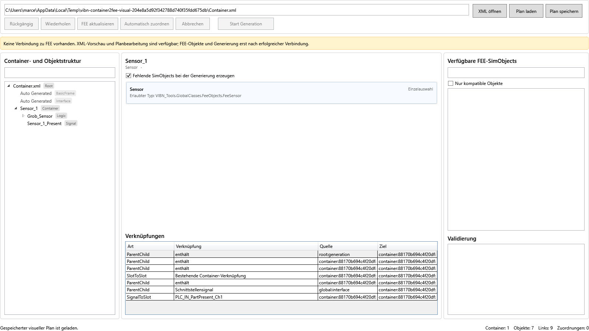

# Container2FEE Visual

## Zweck und Abgrenzung

Der Reiter **Container2FEE Visual** ist ein zusätzlicher, levelgeschützter Arbeitsbereich. Der bestehende Reiter **Container2Fee** und dessen Ablauf bleiben unverändert. Beide Wege verwenden am Ende dieselben Containerklassen und denselben `ContainerToFeeService`; dadurch entsteht kein zweiter Generator mit abweichendem Verhalten.

Die visuelle Seite kann eine Container-XML bereits ohne FEE-Verbindung lesen und als Plan darstellen. Erst das Laden vorhandener SimObjects und **Start Generation** benötigen die in Project Settings bestätigte FEE-Verbindung.



## Bedienablauf

1. **XML öffnen** wählen. Die Quelldatei wird nur gelesen und nicht verändert.
2. Links Container, Logiken, Signale, technische Hilfsobjekte und mögliche SimObject-Ziele prüfen.
3. Nach erfolgreicher FEE-Verbindung **FEE aktualisieren** drücken. Noch freie Ziele werden wie im bisherigen Ablauf anhand von identischem Komponentennamen und kompatiblem Typ automatisch zugeordnet.
4. Ein FEE-SimObject von rechts auf ein kompatibles Ziel in der Mitte ziehen. Ein Einzelziel wird ersetzt, ein Mehrfachziel ergänzt. Dasselbe FEE-Objekt kann nie gleichzeitig mehreren Containern gehören.
5. Optional **Fehlende SimObjects bei der Generierung erzeugen** aktivieren. Ohne Zuordnung und ohne diese Option wird das betreffende SimObject übersprungen.
6. Änderungen mit **Rückgängig/Wiederholen** korrigieren und über **Plan speichern** sichern.
7. Validierung prüfen und erst danach **Start Generation** drücken.

Technische Objekte sind im Baum standardmäßig eingeklappt. Die Suchfelder filtern Plan beziehungsweise FEE-Objekte. **Nur kompatible Objekte** bezieht sich auf das aktuell ausgewählte Ziel.

## Sidecar-Datei

Benutzeränderungen werden nicht in die Container-XML geschrieben. Standardmäßig entsteht daneben:

```text
Container.xml.container2fee.visual.json
```

Gespeichert werden ausschließlich Quellfingerabdruck, Ziel-/FEE-Zuordnungen und Erzeugungswünsche. Der Schreibvorgang erfolgt über eine temporäre Datei und anschließendes Ersetzen. Beim erneuten Öffnen wird der Sidecar automatisch angewendet, sofern der SHA-256-Fingerabdruck der XML noch stimmt. Nach einer XML-Änderung werden alte Zuordnungen nicht stillschweigend übernommen.

## Drag-and-drop-Regeln

- Zulässig sind nur vorhandene FEE-SimObjects, deren Wrapper-Typ dem `AllowedType` des unveränderten Legacy-Containers entspricht.
- Einzelziele besitzen höchstens eine, Mehrfachziele mehrere Zuordnungen.
- Eine Objekt-GUID ist im gesamten Plan höchstens einmal zugeordnet.
- Signal-/Slot- und Parent-/Child-Verknüpfungen werden sichtbar gemacht, aber nicht frei umverdrahtet. Diese Grenze verhindert einen Plan, den der bestehende Generator nicht identisch ausführen könnte.
- Das Entfernen einer Zuordnung löscht kein Objekt in FEE.

## Codeaufteilung

| Bereich | Verantwortung |
| --- | --- |
| `ContainerToFeeVisual/Domain` | stabile Plan-, Knoten-, Kanten-, Ziel- und Zuordnungsmodelle |
| `ContainerToFeeVisual/Planning` | sichere XML-Auswertung und Metadaten der bestehenden Containerklassen |
| `ContainerToFeeVisual/Persistence` | versionierter JSON-Sidecar mit Fingerabdruckprüfung |
| `ContainerToFeeVisual/Discovery` | FEE-Objekterkennung ohne SDK-Objekte an die View weiterzugeben |
| `ContainerToFeeVisual/Execution` | Übertragung des Plans auf frische Legacy-Container und Aufruf des bisherigen Executors |
| `ContainerToFeeVisual/Services` | Orchestrierung, Validierung und Undo/Redo |
| `Application/VM/ContainerToFeeVisualPageVM.cs` | UI-Zustand, Commands, Filter und Status |
| `Application/View/ContainerToFeeVisualPage.xaml` | dreigeteilte WPF-Ansicht und Drag-and-drop-Ziele |

## Bewusste technische Grenzen

Der bestehende FEE-Executor unterstützt keinen transaktionalen Rollback. Wird eine laufende SDK-Schreiboperation abgebrochen, kann bereits erzeugter Inhalt bestehen bleiben und muss in FEE geprüft werden. Der neue Reiter validiert daher vollständig vor dem Start und nutzt den vorhandenen Executor unverändert. Eine freie grafische Neuverdrahtung beliebiger Signale wäre eine Funktionsänderung und ist nicht Bestandteil dieser Version.
